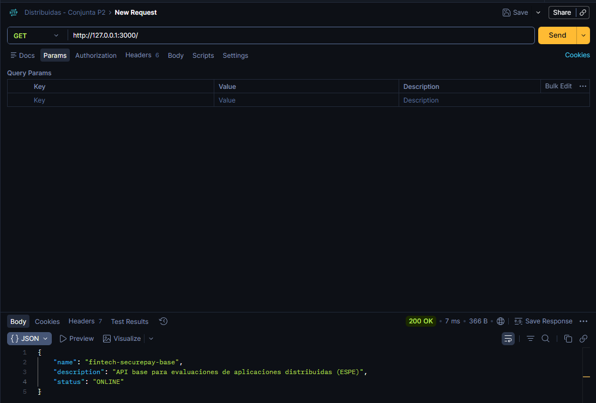
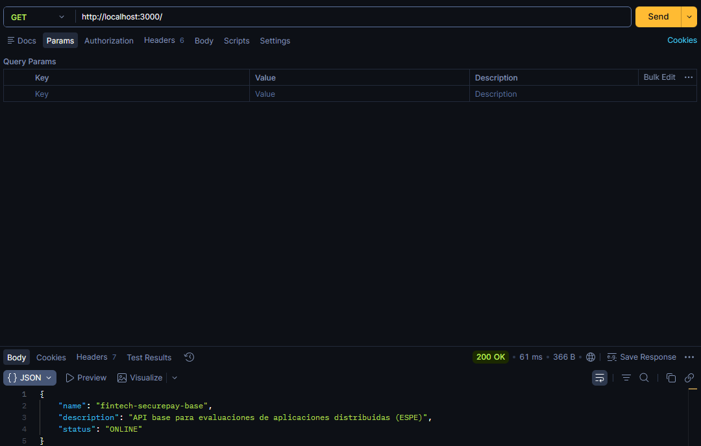
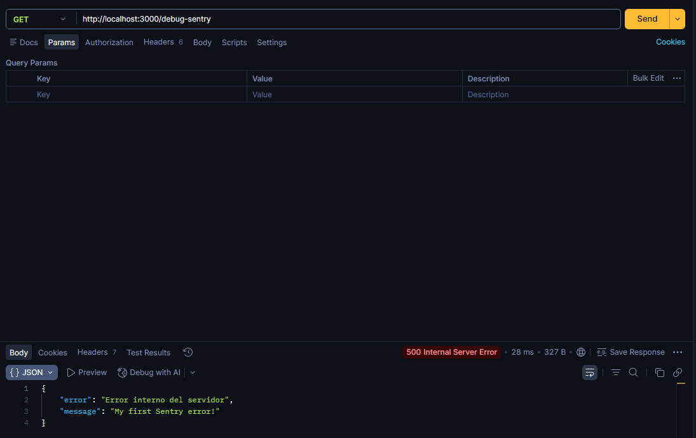
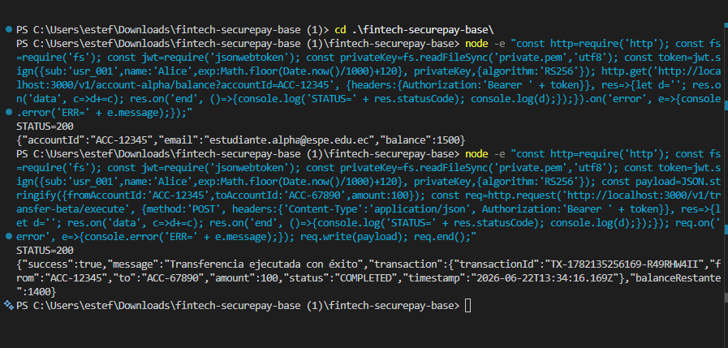
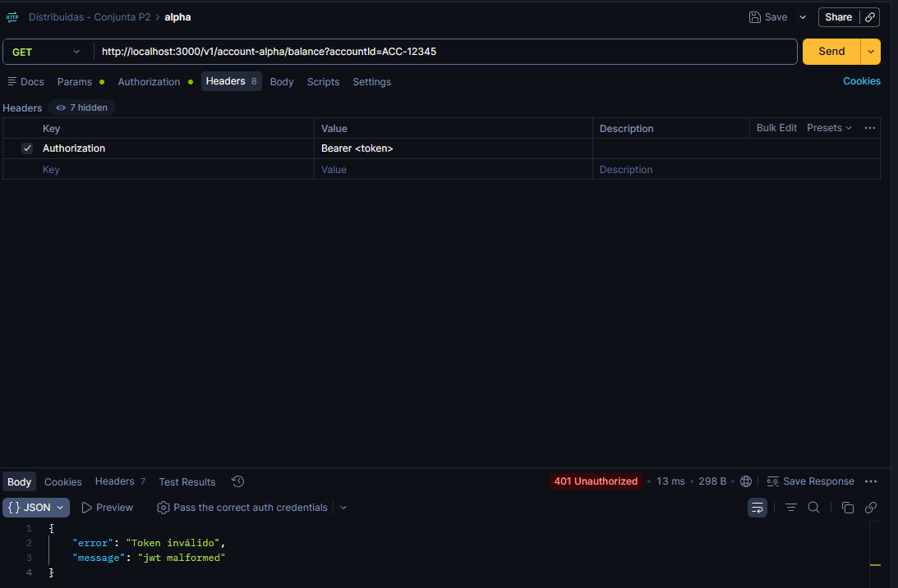
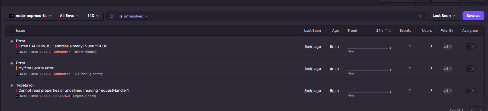

# Bitácora de evaluación — Fintech SecurePay

Durante este proyecto se trabajó sobre una API que debía responder como un sistema distribuido simulado, con separación de responsabilidades, autenticación stateless y observabilidad para errores operacionales. A lo largo del proceso se corrigió la arquitectura, se ajustó la seguridad del flujo JWT y se dejó evidencia de las pruebas realizadas para comprobar el comportamiento del sistema.

## C1: Refactorización SOLID (SRP & DIP)

Desde el inicio, el objetivo fue dejar de trabajar con una lógica monolítica concentrada en un solo punto. Se reorganizó la aplicación para separar responsabilidades entre rutas, controladores, servicios de negocio y servicios auxiliares. Esto permitió que la capa de negocio ya no dependiera directamente de una implementación concreta en cada caso, sino que quedara más preparada para recibir cambios sin afectar el flujo completo.

En la práctica, el servicio financiero quedó desacoplado de la lógica de verificación y del manejo de estado, lo que refleja un enfoque más cercano al principio de responsabilidad única y a la inyección de dependencias.

## C2: Autenticación Stateless (JWT RS256)

Para la autenticación se implementó un flujo basado en JWT con firma asimétrica RS256. El sistema valida el token mediante la clave pública, evitando depender de un secreto compartido y manteniendo el protocolo stateless, tal como corresponde a este tipo de arquitectura.

También se ajustó la manera en que se leen las llaves RSA y el manejo del header de autorización, para que el proceso sea más robusto frente a errores comunes como tokens mal formados o cabeceras incompletas. El resultado fue que las rutas protegidas solo responden correctamente cuando el JWT es válido y está bien estructurado.

## C3: Observabilidad y Sentry Tracking

La observabilidad fue otra parte clave del trabajo. Se integró Sentry para diferenciar correctamente entre errores de seguridad y errores operacionales. Así, cuando la aplicación detecta una falla real del sistema, el evento se reporta con contexto adicional, mientras que los accesos no autorizados se manejan como respuestas `401` sin convertir el problema en un fallo de infraestructura.

Además, se dejó el seguimiento con tags de usuario y operación para que el error quede más claro al momento de revisar el panel.

## C4: GitOps y trazabilidad DevOps

También se cuidó el lado de control de versiones. Se trabajó con ramas separadas por funcionalidad, se mantuvieron mensajes de commit más claros y se registraron cambios progresivos en lugar de dejar todo concentrado en un solo paso. Además, se configuró correctamente el manejo de variables sensibles para que el archivo `.env` no quede expuesto y se dejó una plantilla base (`.env.example`) para facilitar la configuración del entorno.

## Cómo se ejecutó la API

Para validar el sistema, se ejecutó la aplicación con:

```bash
npm install
npm start
```

Una vez iniciada, la API quedó disponible en:

- `http://localhost:3000`

## Evidencia de pruebas realizadas

Durante la validación se ejecutaron pruebas sobre el servidor y sobre los endpoints protegidos. A continuación se dejan las capturas que se registraron para documentar el proceso.

### Servidor corriendo



### Verificación del endpoint raíz



### Prueba con acceso autorizado en Alpha

La verificación final de Alpha quedó registrada con una respuesta exitosa del endpoint protegido.



### Prueba con acceso autorizado en Beta

También se validó el flujo de transferencia con una respuesta correcta del endpoint protegido.



### Evidencia adicional de terminal para Alpha y Beta

Además de las capturas del Postman, se registró la respuesta real desde la terminal para mostrar el comportamiento correcto de ambos endpoints con JWT válido.


### Prueba con token inválido o expirado



### Evidencia en Sentry del error operacional



## Evidencia final de funcionamiento

Tras ejecutar las peticiones con un JWT válido, los resultados obtenidos fueron:

- `GET /v1/account-alpha/balance?accountId=ACC-12345` → `200` con el balance correspondiente.
- `POST /v1/transfer-beta/execute` → `200` con la transacción ejecutada correctamente.

En la evidencia registrada desde terminal también se observaron respuestas exitosas para ambos flujos, lo que confirma que la autenticación y la lógica de negocio quedaron funcionando correctamente.

## Conclusión

Con este trabajo se logró dejar una API más ordenada, con una autenticación más sólida, mejor trazabilidad de errores y una bitácora clara de las pruebas que validan el comportamiento del sistema. La documentación refleja no solo el resultado final, sino también el proceso seguido para corregir, probar y evidenciar cada criterio evaluado.
